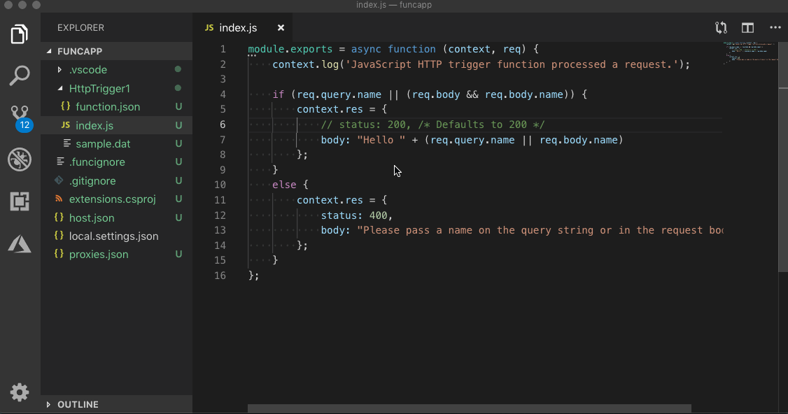
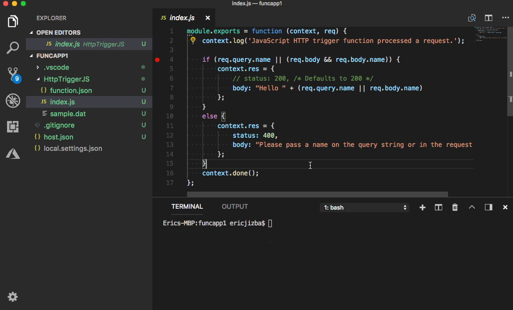

# Azure Functions for Visual Studio Code (Preview)

[](https://marketplace.visualstudio.com/items?itemName=ms-azuretools.vscode-azurefunctions) [](https://marketplace.visualstudio.com/items?itemName=ms-azuretools.vscode-azurefunctions) [](https://travis-ci.org/Microsoft/vscode-azurefunctions) [](https://github.com/Microsoft/vscode-azurefunctions/blob/master/LICENSE.md)

Create, debug, manage, and deploy Azure Functions directly from VS Code. Check
out this [deployment tutorial](https://code.visualstudio.com/tutorials/functions-extension/getting-started)
to get started with the Azure Functions extension.

## Prerequisites

Follow the OS-specific instructions to install the [Azure Functions Core Tools](https://docs.microsoft.com/azure/azure-functions/functions-run-local):

* [Windows](#windows)
* [Mac](#mac) (Homebrew)
* [Linux](#linux) (Ubuntu/Debian)

Install the prerequisites for your desired language:

* [JavaScript](#javascript)
* [C#](#c)
* [Java](#java)
* [Python (Preview)](#python)

> **NOTE**: You may change your `azureFunctions.projectLanguage` user setting to multiple other 'preview' languages not listed above. This allows you to create a project/function in that language, but we do not yet support local debugging for these languages.

## Features

* Create new Function projects
* Create new Functions from a template
* Debug Function projects locally
* Deploy to Azure Function Apps
* View, create, delete, start, stop, and restart Azure Function Apps
* View, edit, upload, and download application settings
* JSON Intellisense for `function.json`, `host.json`, and `proxies.json`
* Stream logs from your remote Function Apps
* Debug Java Function App on Azure (experimental)
    > **NOTE**: To enable it, you can set `azureFunctions.enableRemoteDebugging` to true.

### Create New Project


### Debug Function App Locally



### Deploy to Azure



## OS-Specific Prerequisites

> **NOTE**: npm can be used on all platforms. On unix platforms, you may need to specify `--unsafe-perm` if you are running npm with sudo. That's due to npm behavior of post install script.

### Windows

Both v1 and v2 of the runtime can be installed on Windows. [See here](https://docs.microsoft.com/azure/azure-functions/functions-versions) for more information on each version.

To install v1:

```bash
npm i -g azure-functions-core-tools@1
```

To install v2:

```bash
npm i -g azure-functions-core-tools@2
```

### Mac

```bash
brew tap azure/functions
brew install azure-functions-core-tools
```

### Linux

1. Set up package feed
    * Ubuntu 18.04

        ```bash
        wget -q https://packages.microsoft.com/config/ubuntu/18.04/packages-microsoft-prod.deb
        sudo dpkg -i packages-microsoft-prod.deb
        ```

    * Ubuntu 17.10

        ```bash
        wget -q https://packages.microsoft.com/config/ubuntu/17.10/packages-microsoft-prod.deb
        sudo dpkg -i packages-microsoft-prod.deb
        ```

    * Ubuntu 16.04 / Linux Mint 18

        ```bash
        wget -q https://packages.microsoft.com/config/ubuntu/16.04/packages-microsoft-prod.deb
        sudo dpkg -i packages-microsoft-prod.deb
        ```

1. Install

    ```bash
    sudo apt-get install azure-functions-core-tools
    ```

See [here](https://github.com/Azure/azure-functions-core-tools/blob/master/README.md) for more installation options and the latest instructions.

## Language-Specific Prerequisites

### JavaScript

* [Node 8.0+](https://nodejs.org/)

### C#

* [VS Code Debugger for C#](https://marketplace.visualstudio.com/items?itemName=ms-vscode.csharp)
* [.NET CLI](https://docs.microsoft.com/dotnet/core/tools/?tabs=netcore2x)

> **NOTE**: The default experience for C# uses class libraries (&ast;.cs files), which provide superior performance, scalability, and versatility over C# Scripts (&ast;.csx files). If you want to use C# Scripts, you may change your `azureFunctions.projectLanguage` user setting to `C#Script`.

### Java

* [VS Code Debugger for Java](https://marketplace.visualstudio.com/items?itemName=vscjava.vscode-java-debug)
* [JDK 1.8](http://www.oracle.com/technetwork/java/javase/downloads/index.html)
* [Maven 3.0+](https://maven.apache.org/)
  > **NOTE**: Once Maven is downloaded, you must ensure that Maven is in your PATH environment variable. You can check this by running: `mvn -v`.

### Python

* [Python 3.6.x](https://www.python.org/downloads/)
* To enable project creation and debugging, set `azureFunctions.enablePython` to true. **IMPORTANT**: Python support in Azure is still in private preview.

## Managing Azure Subscriptions

If you are not signed in to Azure, you will see a "Sign in to Azure..." link. Alternatively, you can select "View->Command Palette" in the VS Code menu, and search for "Azure: Sign In".


If you don't have an Azure Account, you can sign up for one today for free and receive $200 in credits by selecting "Create a Free Azure Account..." or selecting "View->Command Palette" and searching for "Azure: Create an Account".

You may sign out of Azure by selecting "View->Command Palette" and searching for "Azure: Sign Out".

To select which subscriptions show up in the extension's explorer, click on the "Select Subscriptions..." button on any subscription node (indicated by a "filter" icon when you hover over it), or select "View->Command Palette" and search for "Azure: Select Subscriptions". Note that this selection affects all VS Code extensions that support the [Azure Account and Sign-In](https://github.com/Microsoft/vscode-azure-account) extension.


## Contributing

There are a couple of ways you can contribute to this repo:

* **Ideas, feature requests and bugs**: We are open to all ideas and we want to get rid of bugs! Use the Issues section to either report a new issue, provide your ideas or contribute to existing threads.
* **Documentation**: Found a typo or strangely worded sentences? Submit a PR!
* **Code**: Contribute bug fixes, features or design changes:
  * Clone the repository locally and open in VS Code.
  * Install [TSLint for Visual Studio Code](https://marketplace.visualstudio.com/items?itemName=eg2.tslint).
  * Open the terminal (press `CTRL+`\`) and run `npm install`.
  * To build, press `F1` and type in `Tasks: Run Build Task`.
  * Debug: press `F5` to start debugging the extension.

### Legal

Before we can accept your pull request you will need to sign a **Contribution License Agreement**. All you need to do is to submit a pull request, then the PR will get appropriately labelled (e.g. `cla-required`, `cla-norequired`, `cla-signed`, `cla-already-signed`). If you already signed the agreement we will continue with reviewing the PR, otherwise system will tell you how you can sign the CLA. Once you sign the CLA all future PR's will be labeled as `cla-signed`.

### Code of Conduct

This project has adopted the [Microsoft Open Source Code of Conduct](https://opensource.microsoft.com/codeofconduct/). For more information see the [Code of Conduct FAQ](https://opensource.microsoft.com/codeofconduct/faq/) or contact [opencode@microsoft.com](mailto:opencode@microsoft.com) with any additional questions or comments.

## Telemetry

VS Code collects usage data and sends it to Microsoft to help improve our products and services. Read our [privacy statement](https://go.microsoft.com/fwlink/?LinkID=528096&clcid=0x409) to learn more. If you don’t wish to send usage data to Microsoft, you can set the `telemetry.enableTelemetry` setting to `false`. Learn more in our [FAQ](https://code.visualstudio.com/docs/supporting/faq#_how-to-disable-telemetry-reporting).

## License

[MIT](LICENSE.md)
